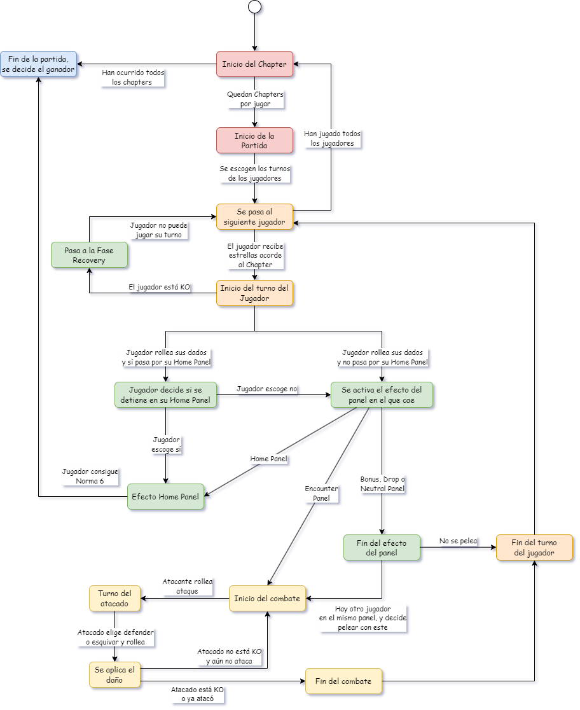

# 99.7% Citric Liquid
Readme in "spanglish", by Diego Vergara V.
## About

`99.7% Citric Liquid` is a simplified clone of the renowned game, `100% Orange Juice`. Its main
purpose is to serve as an educational tool, teaching foundational programming concepts.

📢 **Note**: This project is purely educational and will not be used for any commercial purposes.

---
## Entrega Parcial 5
- Here is the flowchart (in comic sans!)for the whole game (the program starts in the white circle on top of the 
flowchart).

- There are some redundant states, with redundant transitions. This was done deliberately to be more specific with certain 
exceptional states, like a player that reaches Norma level 6, or a Player that decides to stop on their Home Panel.
- Also, the effects of Bonus, Drop and Neutral Panel have been grouped together. This is because they do not present any
special transition to a new state, and are relatively self-contained.
- The combat flowchart has been generalized for both Player vs WildUnit and Player vs Player.

    

This project is licensed under the [Creative Commons Attribution 4.0 International License](http://creativecommons.org/licenses/by/4.0/).

---